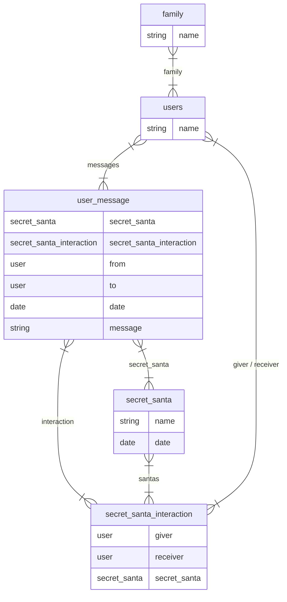

```mermaid
erDiagram
    users {
        string name
    }
    
    secret_santa {
        string name
        date date
    }

    secret_santa_interaction {
        user giver
        user receiver
        secret_santa secret_santa
    }

    user_message {
      secret_santa secret_santa
      secret_santa_interaction secret_santa_interaction
      user from
      user to
      date date
      string message
    }

    users }|--|{ user_message : messages
    user_message }|--|{ secret_santa_interaction : interaction
    user_message }|--|{ secret_santa : secret_santa
    
    secret_santa }|--|{ secret_santa_interaction : santas
    users }|--|{ secret_santa_interaction : "giver / receiver"

    family {
        string name
    }

    family }|--|{ users : family
```